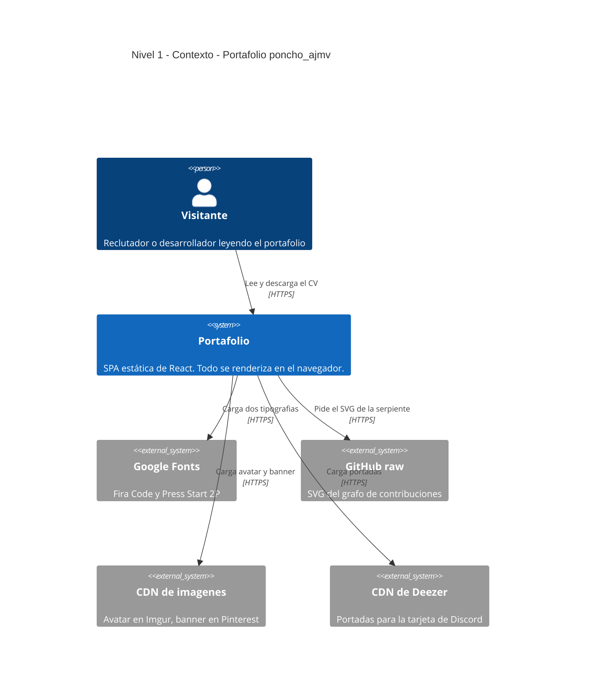
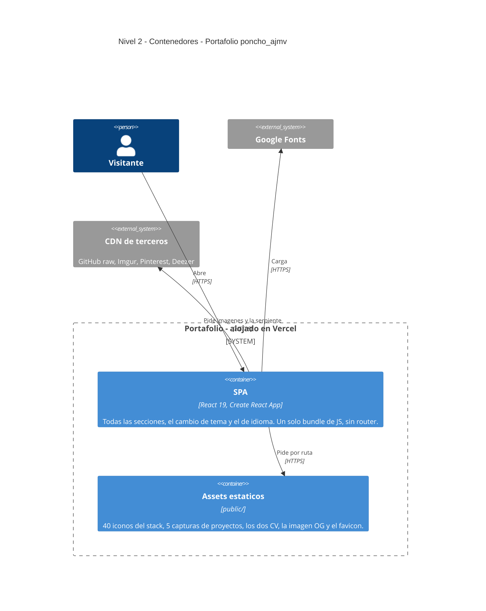
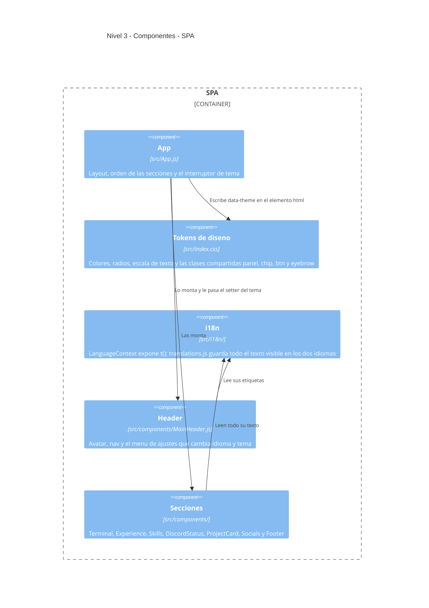

<!-- English: README.md -->

# poncho_ajmv — Portafolio

Portafolio personal de Alfonso Moraga Videz, Ingeniero en Sistemas. Es una SPA de
React que se renderiza en el cliente, sin backend propio, desplegada en Vercel:
**[poncho-ajmv.vercel.app](https://poncho-ajmv.vercel.app/)**

La página abre con una terminal que se escribe sola y cierra con `> exit` en la
misma ventana. En medio: experiencia, stack, proyectos y una tarjeta al estilo del
perfil de Discord. Bilingüe (español / inglés) con tema claro y oscuro.

*[Read in English](README.md)*

---

## Requisitos

| | Versión | Por qué |
|---|---|---|
| **Node.js** | **18 o superior** | Lo pide `react-scripts` 5. No está fijado en `engines`; Vercel usa su versión por defecto. |
| **npm** | **9 o superior** | Viene con Node 18. El repo trae un `package-lock.json` v3. |

Sin base de datos, sin variables de entorno y sin servicios que aprovisionar. Todo
lo que la página necesita está en `public/` o lo pide el navegador en runtime.

---

## Instalación desde cero

```bash
git clone https://github.com/poncho-ajmv/portfolio.git
cd portfolio

npm ci                # usa package-lock.json; npm install también sirve
npm start             # http://localhost:3000
```

Eso es toda la instalación. Para generar el bundle que se despliega:

```bash
npm run build         # escribe build/ — es lo que sirve Vercel
```

---

## Arquitectura (modelo C4)

Los diagramas están en Mermaid, así que GitHub, GitLab y VS Code los dibujan sin
instalar nada. Se usa la sintaxis nativa `C4Context` / `C4Container` /
`C4Component`; upstream sigue marcada como experimental, así que la cantidad de
elementos por diagrama se mantiene baja a propósito.

### Nivel 1 — Contexto

El sistema es un sitio estático. No tiene servidor propio, pero el navegador sí
llama a cuatro terceros en runtime, y si alguno se cae la página se degrada en
lugar de romperse.



### Nivel 2 — Contenedores

Dos piezas desplegables, servidas del mismo origen por Vercel. No hay capa de API
porque no hay datos que servir.



### Nivel 3 — Componentes dentro de la SPA

Cada componente de abajo es una ruta real del repositorio.



**Dónde vive el tema.** Ningún componente sabe qué tema está activo. `App.js`
escribe `data-theme` en `<html>` y los bloques de tokens de `src/index.css`
redefinen los mismos nombres de variable. El cambio va envuelto en la View
Transitions API, que cae a un cambio instantáneo si el navegador no la soporta o si
el visitante pidió menos movimiento.

**Cómo se mantiene alineado el footer con el hero.** `Footer.js` reusa las clases
`.terminal-box` y `.terminal-line` de la terminal del hero y solo sobreescribe el
borde, el glow y el color del texto. Compartir la clase en vez de copiar sus
valores es lo que mantiene idénticas las dos ventanas cuando se toca cualquiera.

---

## Qué NO viene en el repositorio

`.gitignore` los deja fuera. Nada de esto hay que recuperar a mano:

| Ruta | Cómo vuelve |
|---|---|
| `node_modules/` | `npm ci` |
| `build/` | `npm run build` |
| `coverage/` | `npm test -- --coverage` |
| `.env*` | No se usan. El código no lee ninguna variable de entorno. |

---

## Estructura del proyecto

```
src/
├── index.js               Monta App dentro de LanguageProvider
├── index.css              Tokens de diseño y clases compartidas
├── App.js                 Layout y el interruptor de tema
├── App.css                Header y el CTA de contacto
├── components/            Un archivo por sección
├── styles/                Una hoja de estilos por componente
└── i18n/
    ├── LanguageContext.js Proveedor, t() y el atributo lang del documento
    └── translations.js    Todo el texto visible, ES y EN
public/
├── icons/                 40 SVG, servidos localmente
├── index.html             Fuentes, meta tags y data-theme="dark"
├── manifest.json          Nombre e icono de la PWA
└── *.jpg *.pdf *.png      Capturas, los dos CV, avatar, imagen OG
```

---

## Cómo cambiar cosas

| Qué | Dónde |
|---|---|
| Colores, radios, escala de texto | `src/index.css` — los bloques `:root` y `[data-theme="light"]` |
| Cualquier texto visible | `src/i18n/translations.js` |
| Proyectos | `translations.js` para título, descripción y etiquetas; `components/ProjectCard.js` para imágenes y enlaces. **Los dos arrays se unen por índice, así que el orden tiene que coincidir.** |
| Tecnologías del stack | `components/Skills.js`, más el SVG en `public/icons/` |
| Orden de las secciones | `src/App.js` |

---

## Seguridad

No hay backend, ni login, ni formulario que envíe nada a ningún lado, así que la
mayor parte de la superficie habitual no existe acá. Lo que sí vale saber:

- **No hay secretos en el repositorio.** El código no lee variables de entorno y no
  hay ninguna clave hardcodeada. No hay nada que filtrar.
- **El campo del correo es `readOnly`.** Muestra la dirección y alimenta el botón de
  copiar; no acepta escritura.
- **Todos los enlaces externos llevan `rel="noreferrer"`** junto a `target="_blank"`,
  así que el destino no puede alcanzar `window.opener`.
- **Los iconos del stack son locales.** Antes venían de dos CDN; si alguno se caía la
  sección quedaba en blanco. Ahora son archivos en `public/icons/`.
- **Todavía se piden cuatro terceros en runtime** (avatar, banner, portadas, grafo de
  contribuciones). Cada uno tiene respaldo o simplemente no se renderiza, así que una
  falla nunca rompe la página.

---

## Comprobar que funciona

```bash
npm test              # 3 tests: header, nav y el botón de ajustes
npm run build         # tiene que terminar en "Compiled successfully" y sin warnings
```

Un `npm install` limpio, sin lockfile, también compila. Antes fallaba con
`Environment key "jest/globals" is unknown`, por `react-app/jest` en el
`eslintConfig`; esa entrada se quitó.

---

## Despliegue

Vercel construye desde `main` en cada push. Sin archivo de configuración: detecta
Create React App, corre `npm run build` y sirve `build/`.

Para reproducir el output exacto de producción en local:

```bash
npm run build
npx serve -s build
```

---

## Solución de problemas

**No aparece nada arriba del `> exit` en el footer.** Ese es el grafo de
contribuciones de GitHub. Se pide de la rama `output` del repositorio
`poncho-ajmv/poncho-ajmv`; si la Action que lo genera dejó de correr, el fetch falla
en silencio y no se renderiza nada. El resto del footer no se afecta.

**Los nombres del stack no salen en desktop.** Son un tooltip de `:hover`, a
propósito. En pantallas táctiles el nombre va fijo debajo del icono, porque ahí
`:hover` no existe.

**`Browserslist: caniuse-lite is outdated`.** Correr
`npx update-browserslist-db@latest`.

---

## Estado del proyecto

**Funciona:** todas las secciones, los dos idiomas, los dos temas con la transición
diagonal, la descarga del CV según el idioma, los iconos locales, la tarjeta de
previsualización OG, y el layout responsive a 380, 768 y 1280 px.

**Falta o conviene saber:**

- **El tema no se guarda.** Si eliges claro y recargas, vuelve a oscuro. Es a
  propósito; agregarlo es un `localStorage` en el handler y una lectura en el estado
  inicial.
- **Los dos CV necesitan una revisión** contra las entradas de experiencia actuales.
- **No hay CI.** Los tests y el build corren solo en local; nada frena un push malo.
- **No hay archivo de licencia.** `package.json` declara `"private": true` y ningún
  campo `license`, así que por defecto el código es todos los derechos reservados.

---

## Créditos

El avatar es arte de Captain Rex por
[grantgoboom](https://www.deviantart.com/grantgoboom/art/Rex-119528260).
Los iconos del stack vienen de [devicon](https://devicon.dev/) e
[Iconify](https://iconify.design/). Las tipografías son
[Fira Code](https://fonts.google.com/specimen/Fira+Code) y
[Press Start 2P](https://fonts.google.com/specimen/Press+Start+2P).

---

## Contacto

- Correo: alfonsojmoragav@gmail.com
- LinkedIn: [alfonso-javier-moraga-videz](https://www.linkedin.com/in/alfonso-javier-moraga-videz-92b8211bb/)
- GitHub: [poncho-ajmv](https://github.com/poncho-ajmv)
- Discord: poncho_ajmv
