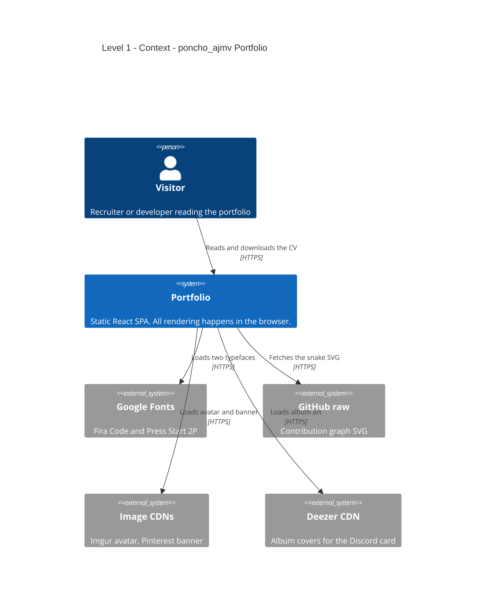
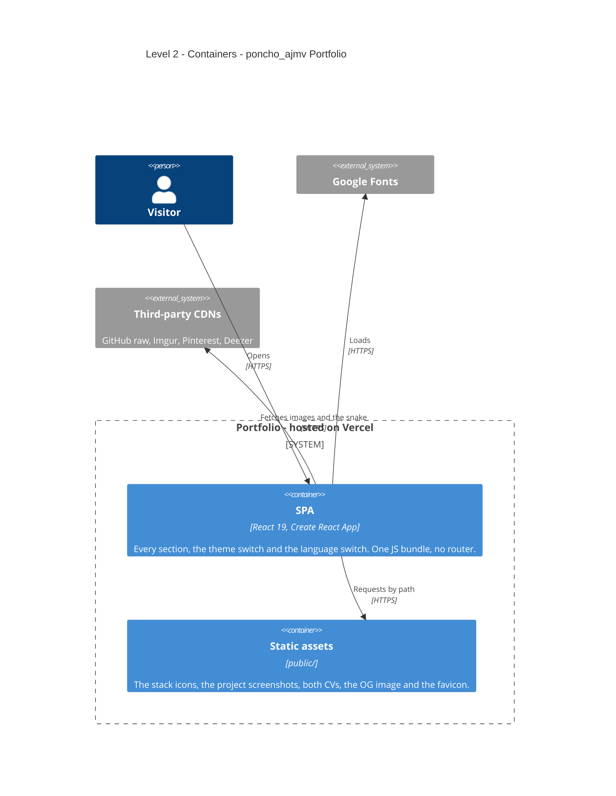
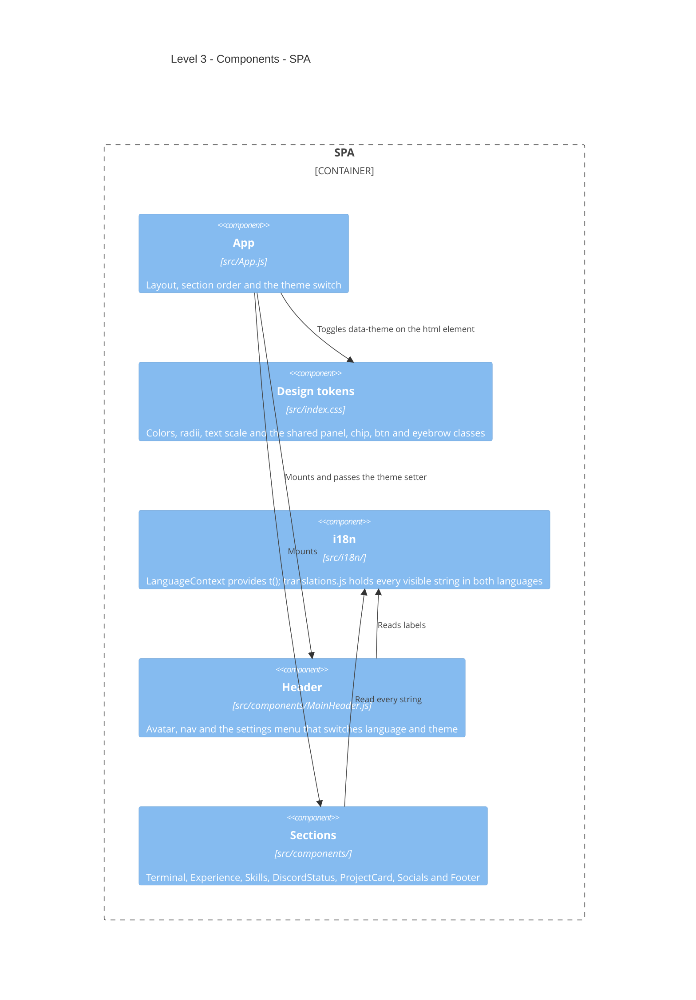

<!-- Español: README.es.md -->

# poncho_ajmv — Portfolio

Personal portfolio of Alfonso Moraga Videz, Systems Engineer. A client-rendered
React SPA with no backend of its own, deployed on Vercel:
**[poncho-ajmv.vercel.app](https://poncho-ajmv.vercel.app/)**

The page opens with a terminal that types itself and closes with `> exit` in the
same window. In between: experience, tech stack, projects and a Discord-style
profile card. Bilingual (Spanish / English) with a light and dark theme.

*[Leer en español](README.es.md)*

---

## Requirements

| | Version | Why |
|---|---|---|
| **Node.js** | **18 or newer** | Required by `react-scripts` 5. Not pinned in `engines`; Vercel picks its default. |
| **npm** | **9 or newer** | Ships with Node 18. The repo has a `package-lock.json` v3. |

No database, no environment variables, no services to provision. Everything the
page needs is either in `public/` or fetched by the browser at runtime.

---

## Install from scratch

```bash
git clone https://github.com/poncho-ajmv/portfolio.git
cd portfolio

npm ci                # uses package-lock.json; npm install also works
npm start             # http://localhost:3000
```

That is the whole setup. To produce the deployable bundle:

```bash
npm run build         # writes build/ — this is what Vercel serves
```

---

## Architecture (C4 model)

Diagrams use Mermaid, so GitHub, GitLab and VS Code render them with nothing
installed. The native `C4Context` / `C4Container` / `C4Component` syntax is used;
it is still marked experimental upstream, so the element count per diagram is
kept low on purpose.

### Level 1 — Context

The system is a static site. It has no server of its own, but the browser does
call four third parties at runtime, and if any of them is down the page degrades
instead of breaking.



### Level 2 — Containers

Two deployable pieces, both served from the same origin by Vercel. There is no
API tier because there is no data to serve.



### Level 3 — Components inside the SPA

Every component below is a real path in the repository.



**Where the theme lives.** No component knows which theme is active. `App.js`
writes `data-theme` on `<html>` and the token blocks in `src/index.css` redefine
the same variable names. The switch is wrapped in the View Transitions API, which
falls back to an instant change when the browser lacks support or the visitor asked
for reduced motion.

**How the footer stays aligned with the hero.** `Footer.js` reuses the
`.terminal-box` and `.terminal-line` classes from the hero terminal and only
overrides the border, the glow and the text color. Sharing the class instead of
copying its values is what keeps the two windows identical when either one is
edited.

---

## What is NOT in the repository

`.gitignore` keeps these out. Nothing here needs to be recovered by hand:

| Path | How it comes back |
|---|---|
| `node_modules/` | `npm ci` |
| `build/` | `npm run build` |
| `coverage/` | `npm test -- --coverage` |
| `.env*` | Not used. The code reads no environment variables. |

---

## Project structure

```
src/
├── index.js               Mounts App inside LanguageProvider
├── index.css              Design tokens and shared classes
├── App.js                 Layout and the theme switch
├── App.css                Header and the contact CTA
├── components/            One file per section
├── styles/                One stylesheet per component
└── i18n/
    ├── LanguageContext.js Provider, t(), and the html lang attribute
    └── translations.js    Every visible string, ES and EN
public/
├── icons/                 Stack icons, self-hosted
├── index.html             Fonts, meta tags and data-theme="dark"
├── manifest.json          PWA name and icon
└── *.jpg *.pdf *.png      Screenshots, both CVs, avatar, OG image
```

---

## How to change things

| What | Where |
|---|---|
| Colors, radii, text scale | `src/index.css` — the `:root` and `[data-theme="light"]` blocks |
| Any visible text | `src/i18n/translations.js` |
| Projects | `translations.js` for title, description and tags; `components/ProjectCard.js` for images and links. **Both arrays are joined by index, so the order has to match.** |
| Stack technologies | `components/Skills.js`, plus the SVG in `public/icons/` |
| Section order | `src/App.js` |

---

## Security

There is no backend, no login and no form that submits anywhere, so most of the
usual surface does not exist here. What is worth knowing:

- **No secrets in the repository.** The code reads no environment variables and no
  key is hardcoded. Nothing to leak.
- **The email field is `readOnly`.** It displays the address and feeds the copy
  button; it accepts no input.
- **Every outbound link uses `rel="noreferrer"`** with `target="_blank"`, so the
  destination cannot reach `window.opener`.
- **Stack icons are self-hosted.** They used to come from two CDNs; if either had
  gone down the section rendered blank. They are now files in `public/icons/`.
- **Four third parties are still fetched at runtime** (avatar, banner, album art,
  contribution graph). Each one has a fallback or simply does not render, so a
  failure never breaks the page.

---

## Verify it works

```bash
npm test              # 3 tests: header, nav and the settings button
npm run build         # must finish with "Compiled successfully" and no warnings
```

A clean `npm install` without the lockfile also builds. That used to fail with
`Environment key "jest/globals" is unknown`, caused by `react-app/jest` in the
`eslintConfig`; that entry was removed.

---

## Deployment

Vercel builds from `main` on every push. No configuration file: it detects Create
React App, runs `npm run build` and serves `build/`.

To reproduce the exact production output locally:

```bash
npm run build
npx serve -s build
```

---

## Troubleshooting

**Nothing shows above `> exit` in the footer.** That is the GitHub contribution
graph. It is fetched from the `output` branch of the `poncho-ajmv/poncho-ajmv`
repository; if the Action that generates it stopped running, the fetch fails
silently and nothing renders. The rest of the footer is unaffected.

**Stack icon names do not appear on desktop.** They are a `:hover` tooltip by
design. On touch screens the name is fixed under the icon instead, because
`:hover` does not exist there.

**`Browserslist: caniuse-lite is outdated`.** Run
`npx update-browserslist-db@latest`.

---

## Project status

**Working:** every section, both languages, both themes with the diagonal
transition, the CV download per language, self-hosted icons, the OG preview card,
and responsive layouts at 380, 768 and 1280 px.

**Missing or worth knowing:**

- **The theme is not persisted.** Choosing light and reloading returns to dark.
  This is deliberate; adding it is a `localStorage` write in the handler and a read
  in the initial state.
- **Both CVs need a review** against the current experience entries.
- **No CI.** Tests and the build run locally only; nothing blocks a bad push.
- **No license file.** `package.json` declares `"private": true` and no license
  field, so the code is all rights reserved by default.

---

## Credits

The avatar is Captain Rex fan art by
[grantgoboom](https://www.deviantart.com/grantgoboom/art/Rex-119528260).
Stack icons come from [devicon](https://devicon.dev/) and
[Iconify](https://iconify.design/). Typefaces are
[Fira Code](https://fonts.google.com/specimen/Fira+Code) and
[Press Start 2P](https://fonts.google.com/specimen/Press+Start+2P).

---

## Contact

- Email: alfonsojmoragav@gmail.com
- LinkedIn: [alfonso-javier-moraga-videz](https://www.linkedin.com/in/alfonso-javier-moraga-videz-92b8211bb/)
- GitHub: [poncho-ajmv](https://github.com/poncho-ajmv)
- Discord: poncho_ajmv
